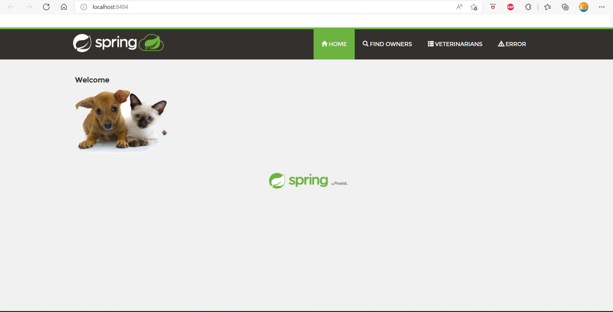
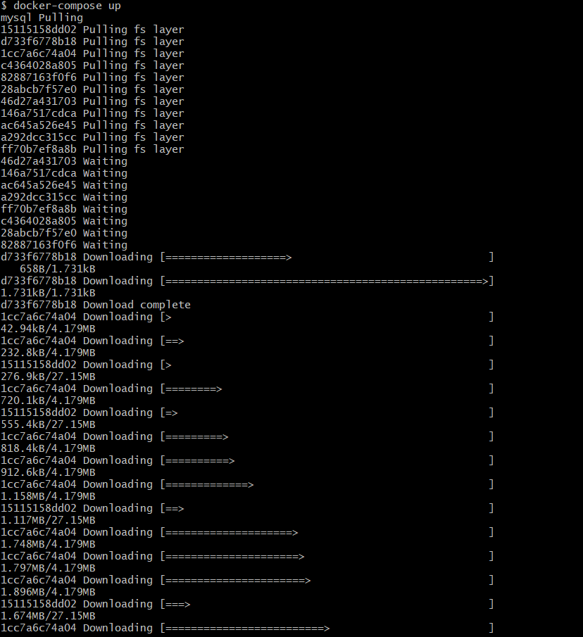
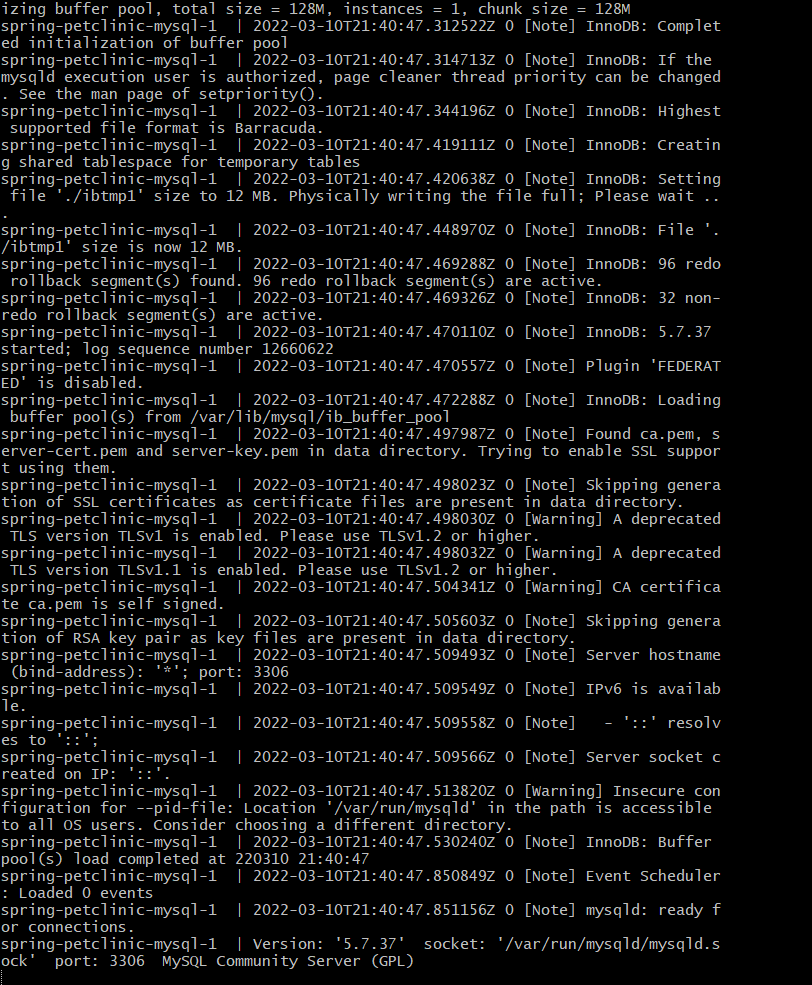
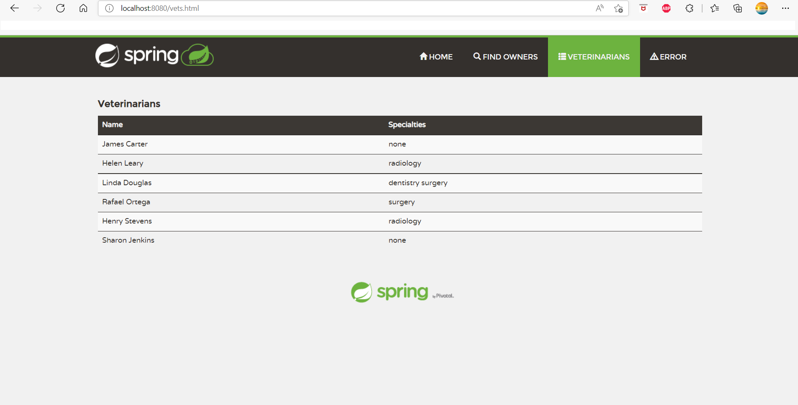
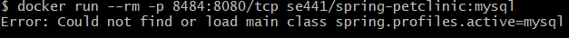

Zhilong Zhou 2029240

DOCKER: 

Dockerfile: C:\Users\akooo\spring-petclinic\Dockerfile

Docker running:

Main page:

DOCKER COMPOSE-MYSQL:

Output from docker-compose up:

Veterinarians page:

Attempt to run application container-error:

DOCKER COMPOSE-APP SERVER AND MYSQL:

Docker-compose.yml(updated): 

Applications-mysql.properties(updated):

Output from docker-compose up:

